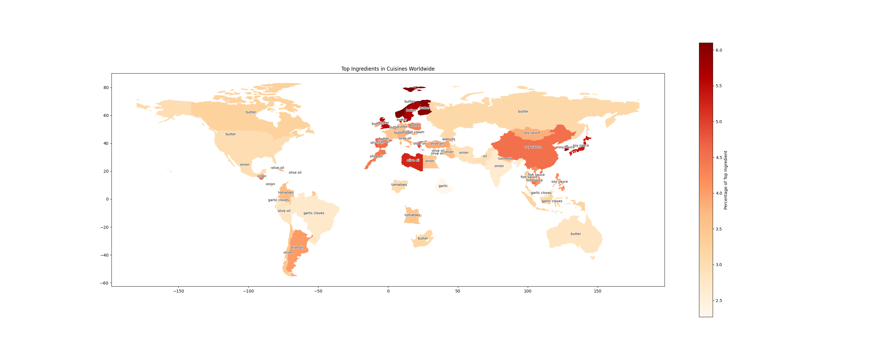

# BioVis_food

Cooking is one of the most common and (ful)filling hobbies. Especially since the last two years
of lockdowns and restrictions, more people started experimenting in their chemical laboratories
known as kitchens. And what probably many of you know well, after a few weeks of home cooking we need to boost our inspiration, unless we want to make the same meals over and over again.

# TODO
- [x] main preprocessing DANIEL
- [ ] formulate the questions better (type of plot, which data)
  - [ ] Which combination of ingredients are most prevalent in each cuisine? VOJTA
  - [ ] Comparative analysis of cuisines (nutritional value, number of steps/ingredients, preparation time, and number of vegan/vegetarian recipes) DANIEL
- [ ] webpage template 
  - [ ] layout, which questions are connected CARLA 
- [ ] visualize each question Amal (Q1)
- [ ] popularity analysis of the cuisines over time MELIS
      
# Dataset food.com
We took a kaggle dataset which scraped data from https://www.food.com/
Kaggle dataset: https://www.kaggle.com/datasets/shuyangli94/food-com-recipes-and-user-interactions

# Questions
- Which combination of ingredients are most prevalent in each cuisine?
- Graph analysis of the similarity of cuisines based on their similar ingredients.
- Which cuisine requires the most __ on average?
  - ingredients
  - steps
  - prep time
- The popularity of cuisines over time.
  
## Q1: Which combination of ingredients are most prevalent in each cuisine?
The most popular ingredients are usually salt, water or sugar so if we ignore these we get a heatmap and a map showing a much better representation of the culture 

**TODO**
- [ ] add a checklist to add or remove salt, sugar, water from the graph
- [ ] Group ingredients by type (spices, dairy, proteins, etc.) to see if there are overarching patterns in ingredient usage across different cuisines.
- [ ] MAYBE? Create a network graph that shows connections between cuisines and ingredients, with the thickness of the lines indicating the strength of association.

Global map
- [x] make it in d3.js
- [x] on hover over add 
  - [ ] an image of the top ingredient 
  - [x] and the top 5 list of ingredients
- [x] use a force-directed layout for the text labels or interactive elements that reveal the text upon hovering

heatmap
- [ ] make it in d3.js
- [ ] add annotations to highlight outliers or specially interesting data points
- [ ] add buttons to see only ticked continents

# Columns of preprocessing
- RAW_recipes
  - name
  - id
  - minutes
  - submitted
  - tags
    - cuisine
    - Vegan
    - Vegetarian
  - nutrition
  - n_steps
  - ingredients
  - n_ingredients
- RAW_interactions
  - for each recipe extra columns
    - all dates
    - all ratings

# Final submission
- [ ] Interactive website
- [ ] presentation
- [ ] GitHub documentation
